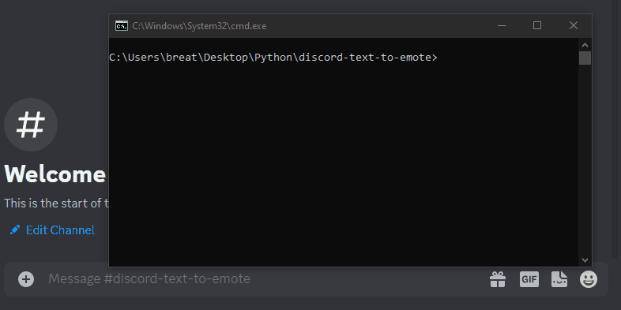

# DISCORD TEXT TO EMOTE

Send messages using discord emote letters to annoy your friends and make people despise you

## Getting Started

### How To Use

You simply run the script, enter the text you want to convert to emotes and press enter. The text will be copied to your clipboard and all you have to do is navigate to the discord chat and press `Ctrl + V`.

> Note : This works with English alphabets `[a-z]` and numbers `[0-9]` only any other character will just be outputted as it was inputted.

### Preview



### Installation

- Python is required to run the script _(This script was made on version 3.11.2)_

Open CMD and run the following commands

```bash
cd %userprofile%\Desktop
```

```bash
curl -O https://www.python.org/ftp/python/3.11.2/python-3.11.2-amd64.exe
```

If you are facing problems with curl, you can just head to [www.python.org](https://www.python.org/downloads/) and download the latest version.

With this you should have the installation file on your desktop _(if you used curl)_ or whatever directory you saved it on. 

Its an easy installation just **make sure to check** the `ADD PATH` option.

- Clone or download the repository

```bash
git clone https://github.com/riad-azz/discord-text-to-emote.git
```

- Navigate to the repository folder

```bash
cd discord-text-to-emote
```

- Run the script

```bash
python run.py
```

## Conclusion

Have fun being annoying to your friends
